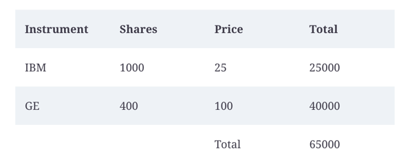
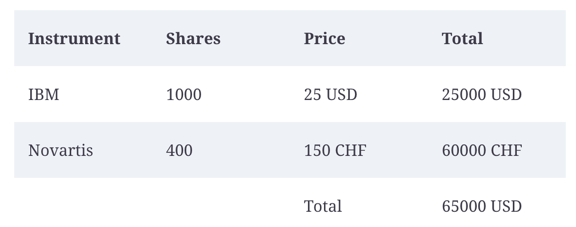

# Multi-Currency Money
Demo de DemoTDD - Charla BI Weekly BE 17-10-21

Supongamos que tenemos el siguiente reporte

Y queremos introducir el concepto de multi-currency money para poder generar un reporte de la siguiente manera

También necesitamos especificar los tipos de cambio

